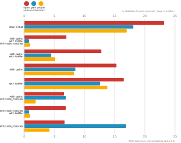
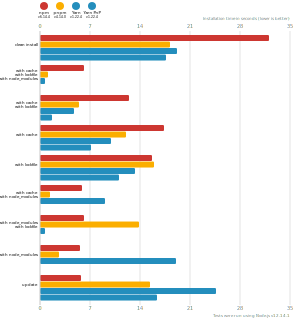
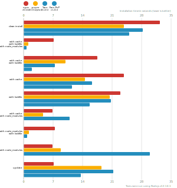
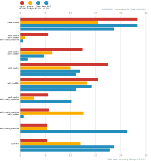
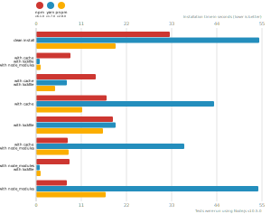

# Node package manager benchmark

This benchmark compares the performance of [npm](https://github.com/npm/npm), [pnpm](https://github.com/pnpm/pnpm) and [yarn](https://github.com/yarnpkg/yarn).

## React app

The app's `package.json` [here](./fixtures/react-app/package.json)

| action  | cache | lockfile | node_modules| npm | Yarn | pnpm |
| ---     | ---   | ---      | ---         | --- | --- | --- |
| install |       |          |             | 26.4s | 19.7s | 20.3s |
| install | ✔    | ✔        | ✔           | 8.6s | 1.2s | 961ms |
| install | ✔    | ✔        |             | 13.4s | 5.3s | 7.5s |
| install | ✔    |          |             | 21.8s | 9.7s | 11.2s |
| install |      | ✔        |             | 16.4s | 13.3s | 17.2s |
| install | ✔    |          | ✔           | 9.2s | 9.1s | 7.5s |
| install |      | ✔        | ✔           | 9.4s | 1.1s | 990ms |
| install |      |          | ✔           | 10.2s | 17.6s | 16.4s |

## Ember app

The app's `package.json` [here](./fixtures/ember-quickstart/package.json)

| action  | cache | lockfile | node_modules| npm | Yarn | pnpm |
| ---     | ---   | ---      | ---         | --- | --- | --- |
| install |       |          |             | 41.6s | 58.5s | 29.7s |
| install | ✔    | ✔        | ✔           | 6.9s | 1.1s | 1.1s |
| install | ✔    | ✔        |             | 14.5s | 9.3s | 9.9s |
| install | ✔    |          |             | 21.6s | 17.1s | 13s |
| install |      | ✔        |             | 32.6s | 31.2s | 35.5s |
| install | ✔    |          | ✔           | 7.6s | 12.1s | 8.7s |
| install |      | ✔        | ✔           | 7.5s | 1s | 1s |
| install |      |          | ✔           | 8s | 28.1s | 23.9s |

## Angular app

The app's `package.json` [here](./fixtures/angular-quickstart/package.json)

| action  | cache | lockfile | node_modules| npm | Yarn | pnpm |
| ---     | ---   | ---      | ---         | --- | --- | --- |
| install |       |          |             | 27.4s | 57.6s | 35.9s |
| install | ✔    | ✔        | ✔           | 7.7s | 1.1s | 996ms |
| install | ✔    | ✔        |             | 13.6s | 6.4s | 8.7s |
| install | ✔    |          |             | 24s | 25s | 27.5s |
| install |      | ✔        |             | 17.2s | 19s | 32s |
| install | ✔    |          | ✔           | 8.3s | 20.7s | 23.8s |
| install |      | ✔        | ✔           | 8.2s | 1s | 1s |
| install |      |          | ✔           | 8.7s | 35.4s | 19.3s |

## Medium Size App

The app's `package.json` [here](./fixtures/medium-size-app/package.json)

| action  | cache | lockfile | node_modules| npm | Yarn | pnpm |
| ---     | ---   | ---      | ---         | --- | --- | --- |
| install |       |          |             | 1m 17.7s | 26s | 19.9s |
| install | ✔    | ✔        | ✔           | 7.4s | 998ms | 1s |
| install | ✔    | ✔        |             | 11.9s | 5s | 7.4s |
| install | ✔    |          |             | 19.9s | 25.1s | 10.3s |
| install |      | ✔        |             | 14.7s | 13.7s | 16.4s |
| install | ✔    |          | ✔           | 8.2s | 13.1s | 23.3s |
| install |      | ✔        | ✔           | 8.1s | 964ms | 1.1s |
| install |      |          | ✔           | 8.7s | 21.2s | 15.9s |

## Lots of Files

The app's `package.json` [here](./fixtures/alotta-files/package.json)

| action  | cache | lockfile | node_modules| npm | Yarn | pnpm |
| ---     | ---   | ---      | ---         | --- | --- | --- |
| install |       |          |             | 28.1s | 32.5s | 21.9s |
| install | ✔    | ✔        | ✔           | 7s | 1.1s | 1.2s |
| install | ✔    | ✔        |             | 15.4s | 8.9s | 7.7s |
| install | ✔    |          |             | 24s | 21.4s | 12.1s |
| install |      | ✔        |             | 19.3s | 19.2s | 17.7s |
| install | ✔    |          | ✔           | 6.7s | 16.5s | 8.5s |
| install |      | ✔        | ✔           | 7.2s | 1.1s | 1.2s |
| install |      |          | ✔           | 6.8s | 25.3s | 17.8s |

