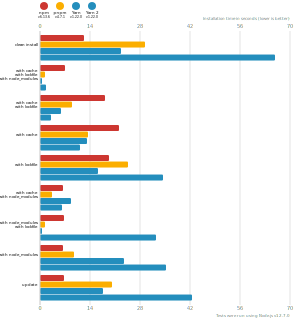

# Benchmarks of JavaScript Package Managers

This benchmark compares the performance of [npm](https://github.com/npm/cli), [pnpm](https://github.com/pnpm/pnpm) and [yarn](https://github.com/yarnpkg/yarn) (both regular and PnP variant).

Here's a quick explanation of how these tests could apply to the real world:

- `clean install`: How long it takes to run a totally fresh install: no lockfile present, no packages in the cache, no `node_modules` folder.
- `with cache`, `with lockfile`, `with node_modules`: After the first install is done, the install command is run again.
- `with cache`, `with lockfile`: When a repo is fetched by a developer and installation is first run.
- `with cache`: Same as the one above, but the package manager doesn't have a lockfile to work from.
- `with lockfile`: When an installation runs on a CI server.
- `with cache`, `with node_modules`: The lockfile is deleted and the install command is run again.
- `with node_modules`, `with lockfile`: The package cache is deleted and the install command is run again.
- `with node_modules`: The package cache and the lockfile is deleted and the install command is run again.
- `update`: Updating your dependencies by changing the version in the `package.json` and running the install command again.

## React App

The app's `package.json` [here](./fixtures/react-app/package.json)

| action  | cache | lockfile | node_modules| npm | pnpm | Yarn | Yarn PnP |
| ---     | ---   | ---      | ---         | --- | --- | --- | --- |
| install |       |          |             | 23.9s | 16.8s | 18.7s | 15.6s |
| install | ✔     | ✔        | ✔           | 6.7s | 1000ms | 826ms | n/a |
| install | ✔     | ✔        |             | 13.8s | 4.8s | 4.5s | 1.7s |
| install | ✔     |          |             | 19s | 8.8s | 10s | 6.4s |
| install |       | ✔        |             | 16.1s | 14.4s | 12.9s | 9.5s |
| install | ✔     |          | ✔           | 6.2s | 1.8s | 7.6s | n/a |
| install |       | ✔        | ✔           | 6.8s | 1s | 807ms | n/a |
| install |       |          | ✔           | 6.2s | 4.3s | 17.8s | n/a |
| update  | n/a   | n/a      | n/a         | 6.5s | 21.6s | 19.5s | 16.7s |

## Ember App

The app's `package.json` [here](./fixtures/ember-quickstart/package.json)

| action  | cache | lockfile | node_modules| npm | pnpm | Yarn | Yarn PnP |
| ---     | ---   | ---      | ---         | --- | --- | --- | --- |
| install |       |          |             | 23.1s | 14.5s | 18.3s | 14.8s |
| install | ✔     | ✔        | ✔           | 5.4s | 978ms | 727ms | n/a |
| install | ✔     | ✔        |             | 11.2s | 4.3s | 3.8s | 1.7s |
| install | ✔     |          |             | 14.8s | 7.5s | 11s | 7.8s |
| install |       | ✔        |             | 13s | 11.9s | 11.2s | 8.7s |
| install | ✔     |          | ✔           | 5.2s | 1.4s | 10.4s | n/a |
| install |       | ✔        | ✔           | 5.6s | 978ms | 697ms | n/a |
| install |       |          | ✔           | 6.2s | 2.3s | 17.3s | n/a |
| update  | n/a   | n/a      | n/a         | 5.4s | 16.3s | 15.3s | 13.9s |

## Angular App

The app's `package.json` [here](./fixtures/angular-quickstart/package.json)

| action  | cache | lockfile | node_modules| npm | pnpm | Yarn | Yarn PnP |
| ---     | ---   | ---      | ---         | --- | --- | --- | --- |
| install |       |          |             | 26.6s | 22.4s | 25.2s | 20.5s |
| install | ✔     | ✔        | ✔           | 6.7s | 1.1s | 770ms | n/a |
| install | ✔     | ✔        |             | 15.1s | 6.4s | 5.6s | 1.8s |
| install | ✔     |          |             | 20.4s | 10.9s | 13.6s | 10s |
| install |       | ✔        |             | 19.3s | 18.3s | 16.7s | 12.9s |
| install | ✔     |          | ✔           | 6.3s | 3.4s | 11.7s | n/a |
| install |       | ✔        | ✔           | 7s | 1s | 783ms | n/a |
| install |       |          | ✔           | 6.5s | 8.6s | 23.7s | n/a |
| update  | n/a   | n/a      | n/a         | 7s | 16.7s | 17.7s | 13.8s |

## Medium Size App

The app's `package.json` [here](./fixtures/medium-size-app/package.json)

| action  | cache | lockfile | node_modules| npm | pnpm | Yarn | Yarn PnP |
| ---     | ---   | ---      | ---         | --- | --- | --- | --- |
| install |       |          |             | 23.6s | 17.6s | 22.6s | 19.2s |
| install | ✔     | ✔        | ✔           | 6s | 962ms | 718ms | n/a |
| install | ✔     | ✔        |             | 12s | 5.3s | 4.5s | 1.7s |
| install | ✔     |          |             | 17.7s | 8.7s | 15s | 11.8s |
| install |       | ✔        |             | 16.1s | 14.9s | 12.7s | 9.9s |
| install | ✔     |          | ✔           | 5.7s | 2.5s | 12.6s | n/a |
| install |       | ✔        | ✔           | 6.2s | 1s | 701ms | n/a |
| install |       |          | ✔           | 5.8s | 7s | 21.3s | n/a |
| update  | n/a   | n/a      | n/a         | 6.2s | 18.4s | 20.1s | 17.7s |

## Lots of Files

The app's `package.json` [here](./fixtures/alotta-files/package.json)

| action  | cache | lockfile | node_modules| npm | pnpm | Yarn | Yarn PnP |
| ---     | ---   | ---      | ---         | --- | --- | --- | --- |
| install |       |          |             | 34.8s | 19.6s | 34.9s | 23.3s |
| install | ✔     | ✔        | ✔           | 7s | 1.1s | 785ms | n/a |
| install | ✔     | ✔        |             | 15.3s | 5.4s | 7.9s | 1.9s |
| install | ✔     |          |             | 22.2s | 9.9s | 21.4s | 13.6s |
| install |       | ✔        |             | 20.3s | 16.4s | 16.6s | 10.9s |
| install | ✔     |          | ✔           | 6s | 2.8s | 17.9s | n/a |
| install |       | ✔        | ✔           | 7s | 1.1s | 797ms | n/a |
| install |       |          | ✔           | 6s | 6.6s | 31.8s | n/a |
| update  | n/a   | n/a      | n/a         | 6.7s | 24.3s | 28.3s | 22.3s |

