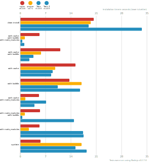

# Node package manager benchmark

This benchmark compares the performance of [npm](https://github.com/npm/npm), [pnpm](https://github.com/pnpm/pnpm) and [yarn](https://github.com/yarnpkg/yarn).

## React app

The app's `package.json` [here](./fixtures/react-app/package.json)

| action  | cache | lockfile | node_modules| npm | Yarn | pnpm |
| ---     | ---   | ---      | ---         | --- | --- | --- |
| install |       |          |             | 25.5s | 18.2s | 19.6s |
| install | ✔    | ✔        | ✔           | 8.6s | 1.2s | 1.1s |
| install | ✔    | ✔        |             | 12.7s | 4.8s | 8.2s |
| install | ✔    |          |             | 21.6s | 9.4s | 10s |
| install |      | ✔        |             | 15.6s | 13.4s | 18.8s |
| install | ✔    |          | ✔           | 8.8s | 9.4s | 6.2s |
| install |      | ✔        | ✔           | 9.5s | 1.2s | 1.1s |
| install |      |          | ✔           | 8.7s | 19.1s | 14.9s |

## Ember app

The app's `package.json` [here](./fixtures/ember-quickstart/package.json)

| action  | cache | lockfile | node_modules| npm | Yarn | pnpm |
| ---     | ---   | ---      | ---         | --- | --- | --- |
| install |       |          |             | 31.8s | 39.4s | 29.2s |
| install | ✔    | ✔        | ✔           | 6.9s | 1.1s | 1.1s |
| install | ✔    | ✔        |             | 14.4s | 8.7s | 10.7s |
| install | ✔    |          |             | 34.4s | 16.5s | 12.1s |
| install |      | ✔        |             | 21.3s | 26.1s | 30.9s |
| install | ✔    |          | ✔           | 7s | 15.7s | 8.1s |
| install |      | ✔        | ✔           | 7.2s | 1s | 1.1s |
| install |      |          | ✔           | 7.4s | 34.9s | 24.7s |

## Angular app

The app's `package.json` [here](./fixtures/angular-quickstart/package.json)

| action  | cache | lockfile | node_modules| npm | Yarn | pnpm |
| ---     | ---   | ---      | ---         | --- | --- | --- |
| install |       |          |             | 29.2s | 56.4s | 26.3s |
| install | ✔    | ✔        | ✔           | 7.8s | 1.1s | 1.2s |
| install | ✔    | ✔        |             | 14.1s | 6.4s | 10.4s |
| install | ✔    |          |             | 24.9s | 1m 8.4s | 12.1s |
| install |      | ✔        |             | 18.9s | 20.5s | 26.1s |
| install | ✔    |          | ✔           | 8.2s | 53.6s | 8.5s |
| install |      | ✔        | ✔           | 8.7s | 1.1s | 1.2s |
| install |      |          | ✔           | 9s | 1m 14.7s | 20.3s |

## Medium Size App

The app's `package.json` [here](./fixtures/medium-size-app/package.json)

| action  | cache | lockfile | node_modules| npm | Yarn | pnpm |
| ---     | ---   | ---      | ---         | --- | --- | --- |
| install |       |          |             | 28.1s | 22.7s | 28.7s |
| install | ✔    | ✔        | ✔           | 7.1s | 1s | 1.1s |
| install | ✔    | ✔        |             | 11.6s | 4.7s | 8s |
| install | ✔    |          |             | 20.4s | 47.3s | 9.7s |
| install |      | ✔        |             | 14.5s | 13.2s | 18.2s |
| install | ✔    |          | ✔           | 7.9s | 28.5s | 6.2s |
| install |      | ✔        | ✔           | 8.1s | 976ms | 1.3s |
| install |      |          | ✔           | 7.5s | 21.4s | 15.8s |

## Lots of Files

The app's `package.json` [here](./fixtures/alotta-files/package.json)

| action  | cache | lockfile | node_modules| npm | Yarn | pnpm |
| ---     | ---   | ---      | ---         | --- | --- | --- |
| install |       |          |             | 28.8s | 28.1s | 21s |
| install | ✔    | ✔        | ✔           | 6.8s | 1.1s | 1.4s |
| install | ✔    | ✔        |             | 15.1s | 7.9s | 8.9s |
| install | ✔    |          |             | 25.1s | 19.3s | 10.8s |
| install |      | ✔        |             | 18.5s | 17.5s | 22.3s |
| install | ✔    |          | ✔           | 6.9s | 18.6s | 7.5s |
| install |      | ✔        | ✔           | 7.3s | 1s | 1.4s |
| install |      |          | ✔           | 7s | 27.9s | 17.6s |

